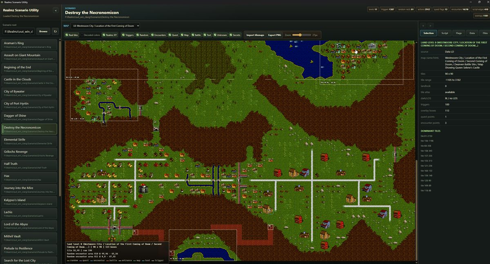

# Realmz Scenario Utility

Local read-only tools for inspecting Realmz scenario folders.



## Run

```powershell
npm start
```

Then open:

```text
http://127.0.0.1:5177
```

By default the app reads scenario folders from:

```text
F:\Realmz\base\Realmz\Scenarios
```

Override that with:

```powershell
$env:REALMZ_SCENARIO_ROOT = "F:\Realmz\out_win_clang\bin\Scenarios"
npm start
```

## Desktop App

Install dependencies once:

```powershell
npm install
```

Run the Tauri desktop launcher in development:

```powershell
npm run desktop
```

The Tauri launcher starts the existing local Node server on a private localhost port, then opens the native system webview. This avoids bundling Chromium with the app. Packaged desktop builds include a bundled Node runtime, so end users do not need to install Node.js separately. Source/development runs still require Node.js 20 or newer on `PATH`.

Build a Windows installer:

```powershell
npm run dist:win
```

Build a Linux AppImage from a Linux machine:

```powershell
npm run dist:linux
```

The repository also includes a GitHub Actions release workflow that builds Windows NSIS and Linux AppImage bundles on native hosted runners when a `v*` tag is pushed, or when the workflow is run manually. The packaged app includes a generated Node runtime under `vendor\runtime`, extracted Realmz icon and picture PNGs, and the standard Family Jewels resource fallback under `assets\realmz\resources`.

The desktop launcher remembers the last successfully loaded scenarios folder. If there is no remembered folder, it first looks for a `Scenarios` folder one directory above the utility install folder, which supports installing the utility in its own folder inside a Realmz directory. It then falls back to a `Scenarios` folder next to the launcher.

The build outputs land under `src-tauri\target\release\bundle`. On Windows, the NSIS installer is under:

```text
src-tauri\target\release\bundle\nsis
```

The Linux AppImage output is under:

```text
src-tauri\target\release\bundle\appimage
```

Packaged builds keep their writable tile-atlas cache under Tauri's per-user app data folder instead of writing into the app bundle. Set `REALMZ_SCENARIO_ROOT` and `REALMZ_REFERENCE_ROOT` before launching if Realmz is not in the default location.

## Current Coverage

The parser is read-only and decodes these source scenario files:

- `Data LD` / `Data DL`: 90 x 90 land and dungeon field grids.
- `Data DD` / `Data DDD`: 100 trigger/action records per level.
- `Data RD` / `Data RDD`: random encounter rectangles and level metadata.
- `Data ED3`: macro/action door records.
- `Data EDCD`: five-short extra-code records.
- `Data ED` / `Data ED2`: simple and complex encounter records, including the legacy partial-record behavior used by the game cache builder.

The UI currently provides:

- Scenario folder discovery and per-file size/hash inventory.
- Abstract map rendering from decoded field grids, plus a real-tile toggle that imports/caches atlas PNGs from Realmz resource forks through `/api/asset/tile-atlas`.
- Normalized bounding-box overlays for trigger, random, encounter, quest, map mutation, battle, text, and unknown content categories.
- Door/action inspection with opcode labels and EDCD links.
- A Script tab with graph nodes for map triggers, macros, EDCD rows, and simple/complex encounters.
- Quest flag read/write indexing for opcodes `46`, `47`, `72`, `76`, and `77`.
- Static links from trigger opcodes to simple/complex encounters, macro action data, opcode `7` EDCD rows, branch targets, and gosub/keepcodes/forcebranch markers.
- A Data tab that indexes battles, monsters, shops, strings, maps, treasure, thief encounters, time encounters, contact data, menu metadata, and solids.

Tile atlas endpoint:

```text
/api/asset/tile-atlas?scenarioPath=F:\Realmz\base\Realmz\Scenarios\Tutorial&landlook=0
```

The browser never decodes PICT data. If a utility-side exporter has written `tmp\tile-atlases\<scenario-cache-key>\landlook-N.png`, the endpoint serves that PNG. Otherwise it returns a structured fallback response and the map uses decoded colors.

Tilemap import endpoint:

```text
POST /api/asset/import-tile-atlases?scenarioPath=F:\Realmz\base\Realmz\Scenarios\War in the Sword Lands
```

This imports every landlook used by the scenario. Standard landlooks come from `F:\Realmz\base\Realmz\Data Files\The Family Jewels.rsrc`; custom landlooks `6`, `7`, and `8` come from the scenario's `Scenario.rsrc` when present. The importer writes only under this utility's `tmp\tile-atlases` cache.

## Next Format Passes

Good next slices:

- Broaden the current PICT importer beyond the 8-bit PackBitsRect tilemaps if future assets need other PICT encodings.
- Expand flag semantics beyond quest flags into encounter state, shop state, NPC/allies, timed encounters, and map mutations.
- Add reverse link panels for encounters, monsters, shops, treasures, strings, text prompts, and battles.
- Parse `Scenario` / resource-fork metadata for scenario start positions, names, and resource-backed strings.
- Add search and graph views so every decoded record can answer "what writes this?" and "what reads this later?"
